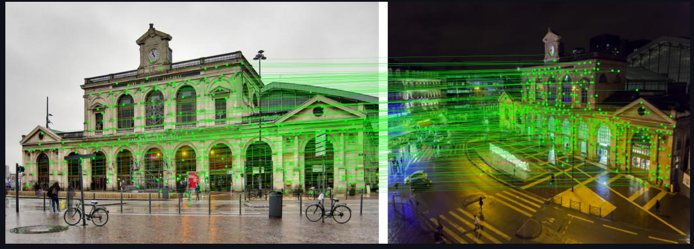

# LightGlue Streamlit Application

This Streamlit application demonstrates the usage of LightGlue, a new technology that makes it easier and quicker to find similarities between pictures. It allows you to choose two images and find their similarities by clicking the "Matching" button.



## Getting Started

To run this application locally, follow the instructions below:

1. Clone the repository:

   ```shell
   git clone https://github.com/emaddar/LightGlue_streamlit.git
   ```

2. Install the required dependencies:
    ```shell
        pip install -r requirements.txt
    ```
3. Run the application:
    ```shell
    streamlit run app.py
    ```
4. The application will be accessible at http://localhost:8501 in your web browser.


## Usage
### Upload Image 1:

- Click on the "Upload your image 1" button and select an image file (PNG, JPEG, or JPG format).
- The selected image will be displayed on the left side of the application.

### Upload Image 2:


- Click on the "Upload your image 2" button and select another image file.
- The selected image will be displayed on the right side of the application.

### Click the "Matching" button:

- After uploading both images, click on the "Matching" button to find the similarities between them.
- The application will display the matched keypoints and visualize the similarities between the images.


## References
## References

- [LightGlue: Local Feature Matching at Light Speed](https://arxiv.org/pdf/2306.13643.pdf) - Lindenberger, P., Sarlin, P.-E., & Pollefeys, M.

- [LightGlue: (GitHub Repo)](https://github.com/cvg/lightglue?utm_source=tldrai)
---

This Streamlit application is developed using the LightGlue technology to showcase its capabilities in finding similarities between images. Feel free to explore and experiment with different image pairs to discover their similarities!

